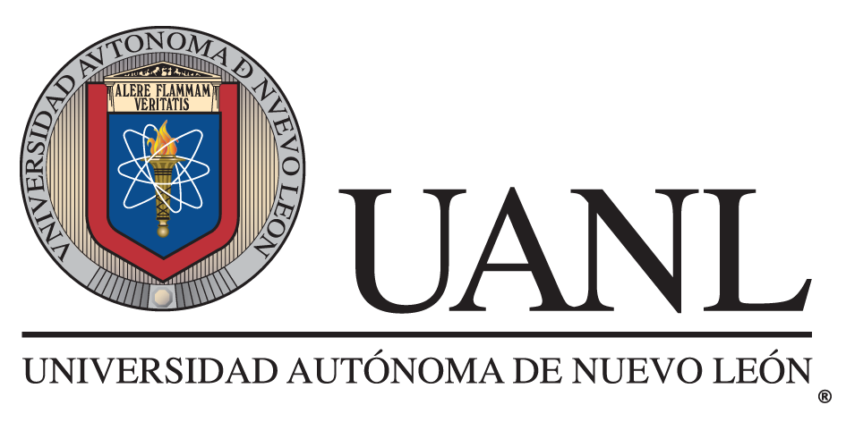

Documents used for a semantic atlas of the poster: 

# Didactic strategies for engineering mathematics: bridging the theory-application gap

Presented for the Sixth conference of the International Network for Didactic Research in University Mathematics - 	**INDRUM 2026**

15-19 Jun 2026 Dubrovnik (Croatia)

To enable links in PDF Files, you need to download each document.

### Code will soon be shared in this same project.

